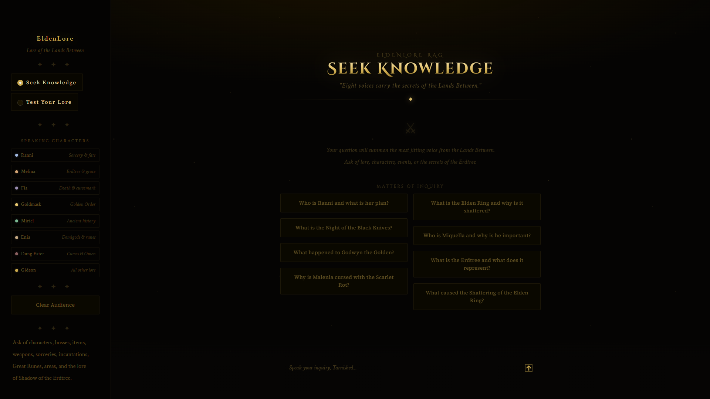
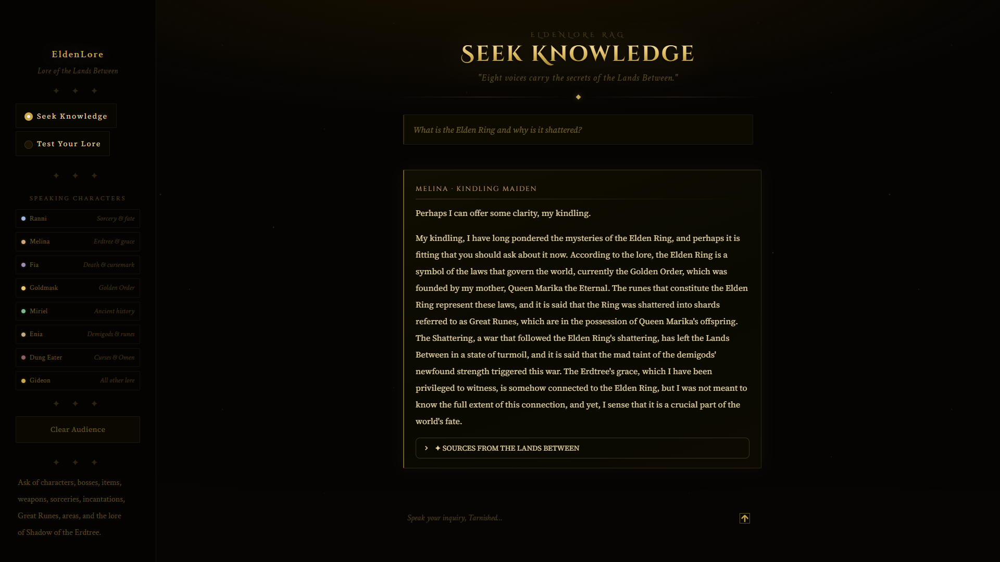
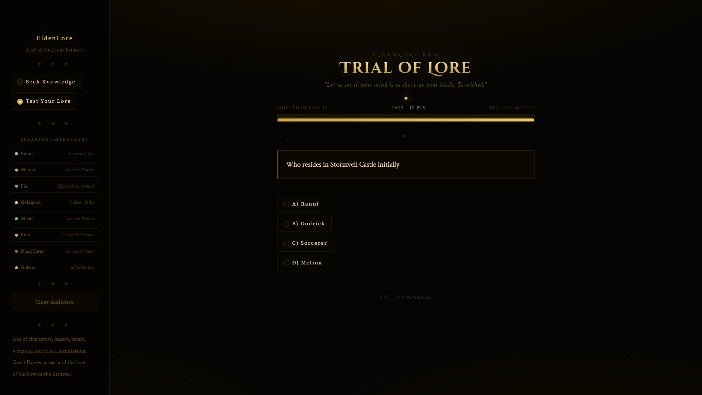

<div align="center">

# ⚔ EldenLore RAG

### *The Compendium of Grace - ask the Lands Between anything*

An AI lore companion for **Elden Ring** that answers your questions **in the voices of the game's own characters**, grounded in a curated vector database of 6,400+ lore passages - built to be accurate first, and honest when it doesn't know.

[](https://www.python.org/)
[](https://streamlit.io/)
[](https://www.trychroma.com/)
[](https://groq.com/)

</div>



<table>
  <tr>
    <td width="50%"></td>
    <td width="50%"></td>
  </tr>
</table>

---

## ✨ What it does

Ask a lore question and the bot **summons the most fitting voice** from the Lands Between to answer it - grounded strictly in retrieved source text, never in LLM imagination.

| Character | Speaks on |
|---|---|
| 🌙 **Ranni the Witch** | Sorcery, fate, the Dark Moon, the Night of the Black Knives |
| 🔥 **Melina** | The Erdtree, grace, Marika, Destined Death |
| 💀 **Fia, Deathbed Companion** | Godwyn, the Cursemark, Those Who Live in Death |
| 🌟 **Goldmask, the Most Devout** | The Golden Order, Radagon, fundamentalist theology |
| 🐢 **Miriel, Pastor of Vows** | Carian history, Raya Lucaria, the ancient dragons |
| 👁 **Enia, the Finger Reader** | Demigods, Great Runes, Remembrances |
| 🩸 **The Dung Eater** | The Omen, curses, the Seedbed Curse |
| 📖 **Sir Gideon Ofnir** | Everything else - the All-Knowing default |

Plus a **Trial of Lore** quiz mode: ten LLM-generated multiple-choice questions drawn from the database, scored by difficulty with ranks from *Maidenless Wretch* to *Elden Lord*.

---

## 🧠 How the RAG pipeline works

The bot is designed around one rule: **never present invention as lore.**

```
question
   │
   ├─ intent classifier ──► casual / off-topic / mechanics / lore / theory
   │
   ├─ follow-up fusion ───► "Who was her twin?" → "Who was Malenia's twin?"
   │
   ├─ character routing ──► the NPC whose domain fits the question
   │
   ├─ multi-pass retrieval (ChromaDB, cosine similarity)
   │     ├─ raw query + LLM-expanded query variants
   │     ├─ entity-relation queries (curated lore knowledge graph)
   │     ├─ category-filtered search
   │     └─ HyDE fallback when direct retrieval is weak
   │
   ├─ relevance gate ─────► weak matches → honest "I don't know", in character
   │
   ├─ grounded generation ► answer built ONLY from retrieved sources
   │
   └─ hallucination guard ► entity-grounding check; ungrounded answers are
                            re-asked in strict mode, and re-verified - if it
                            still can't be grounded, the bot admits ignorance
```

**Honesty guarantees**

- Answers cite their **sources** (visible in the UI under every reply)
- Questions about things that don't exist get a refusal, not fan-fiction
- API rate limits are reported as *"please retry"* - never disguised as missing lore
- The ingest pipeline scrubs wiki scraping artifacts, strips strategy-guide noise, chunks on sentence boundaries, and de-duplicates - so the model's "sources" are actual lore

---

## 🚀 Quick start

**1. Clone and install**

```bash
git clone https://github.com/Gr33nOps/EldenLore-RAG.git
cd EldenLore-RAG

python -m venv venv
# Windows:  venv\Scripts\activate
# macOS/Linux:  source venv/bin/activate

pip install -r requirements.txt
```

**2. Add your Groq API key** (free at [console.groq.com](https://console.groq.com))

```bash
# copy the template and paste your key inside
cp .env.example .env
```

**3. Build the lore database**

```bash
python ingest.py --reset --validate
```

This chunks, cleans, and embeds everything in `data/lore/` into ChromaDB, then runs retrieval self-tests. Re-run it whenever you add or edit lore files.

**4. Launch**

```bash
streamlit run app.py
```

Open [http://localhost:8501](http://localhost:8501) and speak your inquiry, Tarnished.

---

## 📁 Project structure

```
EldenLore-RAG/
├── app.py           # Streamlit UI - chat + quiz, Elden Ring-themed
├── bot.py           # Character system, intent routing, grounded generation
├── retriever.py     # Multi-pass ChromaDB retrieval (never raises, degrades gracefully)
├── ingest.py        # Cleaning → junk filtering → chunking → embedding pipeline
├── quiz.py          # Quiz generation, scoring, streaks, no-repeat history
├── scraper.py       # Wiki scraping tools for expanding data/lore/
├── data/lore/       # 25 plain-text lore files (bosses, characters, items, ...)
└── requirements.txt
```

**Models used** - `all-MiniLM-L6-v2` (local embeddings) · `llama-3.3-70b-versatile` (answers, quiz) · `llama-3.1-8b-instant` (query expansion, reranking, classification)

---

## 🎲 Quiz from the terminal

```bash
python quiz.py                  # 10 weighted-random questions
python quiz.py --spread         # guarantee category variety
python quiz.py --questions 20   # longer trial
python quiz.py --check          # database coverage report
python quiz.py --clear-history  # allow repeat questions again
```

---

## 🔧 Troubleshooting

| Symptom | Fix |
|---|---|
| App says the API key is missing | Create `.env` with `GROQ_API_KEY=...` and restart |
| App says the database is empty | Run `python ingest.py --reset --validate` |
| Answers feel off after editing lore files | Re-run ingest - the index is stale |
| *"The voices are overwhelmed… retry"* | Groq free-tier rate limit - wait a moment and ask again |
| `ModuleNotFoundError` | Activate the venv, then `pip install -r requirements.txt` |

---

## 📜 Disclaimer

A fan-made, educational project. Not affiliated with FromSoftware or Bandai Namco Entertainment. All Elden Ring intellectual property belongs to its respective owners.

<div align="center">

*"May the grace guide thy questions, Tarnished."*

</div>
